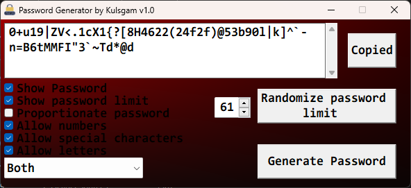

# Cryptographically Secure Password Generator by Kulsgam
Click the image below to watch the video

[](https://youtu.be/i7HwYwaZGCc)
&nbsp;
#### **Description:** A GUI based secure password generator with multiple options, which allow the customization of the password to be generated. Made purely with C and WIN32 API(no MFC). BCrypt by windows is used to generated the randomness.
&nbsp;
#### **Compilation steps:** This project was compiled through VS code using MinGW. The following commands were used.
```
gcc -shared 'Password Generator.c' -o 'Password Generator.dll' -mwindows -lComctl32 -lUxtheme -lbcrypt 
```
```
windres --input resource.rc --output resource.res --output-format=coff
```
```
gcc "Password Generator.c" "Password Generator.dll" resource.res -o "Password Generator.exe" -mwindows -lComctl32 -lUxtheme -lbcrypt
```

## File descriptions
**Password Generator.c:** Has the code needed for the GUI. Also is the starting point of the application.

**Password Generator.exe.manifest:** Contains info neede to enable latest visual styles( eg:- modern looking controls depending on the OS ). 

**Definitions.h:** Specifies constants needed for the program. Mainly control positions and sizes which will prove useful if the positions of the controls need to be changed in the future.

**Global Variables.h:** Specifies all the global variables used

**Functions.h:** Contains code needed for the core of generating the password and other non-GUI functions.

**resource.h:** Contains definitions needed by the resource.rc file. This is needed for definining the icon constant in this project. This allows the icon to be compiled into the executable.

**resource.rc:** Code needed to use the manifest file data. Also has code to compile the icon into the executable.

**Icon.ico:** Inspiration taken from <https://www.pngegg.com/en/png-wvpvx>

## Controls explained
**Generate button:** Generates a password. The password is edit-able within the password display text box.

**Copy button:** Copies the generated password.

**Randomize password limit button:** Randomizes the password limit from 8 to 99. The password limit is the number of characters the password should have. The user can specify their own limit( between 8 and 99 ) if they wish to. If the limit is below 8, the limit will be randomized.

**Show password checkbox:** Shows or hides the password text box.

**Show password limit:** Shows or hides the password limit text box

**Proportionate password:** A password generating algorithm in which all character types have roughly the same number of instances in the password. If this is not checked another algorithm will be used in which the character type instances will not be roughly equal.

**Allow numbers:** Numbers are allowed in the password.

**Allow special characters:** Special characters( eg:- /&*\|! ) are allowed in the password.

**Allow letters:** Letters are allowed in the password. The user has the option to choose uppercase, lowercase or both for the letter generation.
